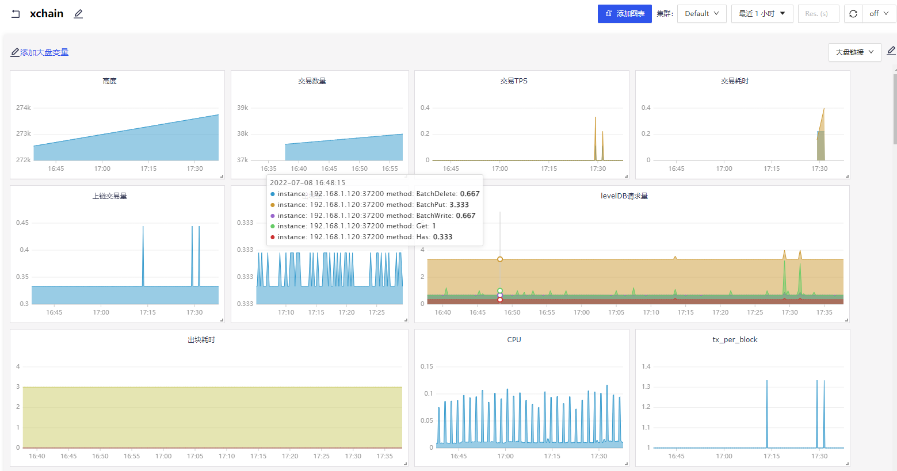

> 夜莺是一款开源的云原生监控系统，采用 All-In-One 的设计，提供企业级的功能特性，开箱即用的产品体验。推荐升级您的 Prometheus + AlertManager + Grafana 组合方案到夜莺。

>chaineye是一款开源的联盟链监控平台，目前已经支持百度XuperChain，提供企业级的功能特性，开箱即用的产品体验。

#### 1. 开箱即用
支持 Docker、Helm Chart 等多种部署方式，内置多种监控大盘、快捷视图、告警规则模板，导入即可快速使用，活跃、专业的社区用户也在持续迭代和沉淀更多的最佳实践于产品中；

#### 2. 兼容并包
支持 [Categraf](https://github.com/flashcatcloud/categraf)、Telegraf、Grafana-agent 等多种采集器，支持 Prometheus、VictoriaMetrics、M3DB 等各种时序数据库，支持对接 Grafana，与云原生生态无缝集成；

#### 3. 开放社区
托管于[中国计算机学会开源发展委员会](https://www.ccf.org.cn/kyfzwyh/)，有[快猫星云](https://flashcat.cloud)的持续投入，和数千名社区用户的积极参与，以及夜莺监控项目清晰明确的定位，都保证了夜莺开源社区健康、长久的发展；

#### 4. 高性能
得益于夜莺的多数据源管理引擎，和夜莺引擎侧优秀的架构设计，借助于高性能时序库，可以满足数亿时间线的采集、存储、告警分析场景，节省大量成本；

#### 5. 高可用
夜莺监控组件均可水平扩展，无单点，已在上千家企业部署落地，经受了严苛的生产实践检验。众多互联网头部公司，夜莺集群机器达百台，处理十亿级时间线，重度使用夜莺监控；

#### 6. 灵活扩展
夜莺监控，可部署在1核1G的云主机，可在上百台机器部署集群，可运行在K8s中；也可将时序库、告警引擎等组件下沉到各机房、各region，兼顾边缘部署和中心化管理；

## 预览


## 快速安装
- 前置:需要安装Prometheus或者其他工具作为数据源。已有正在运行的XuperChain网络。
- 克隆项目到本地 项目地址 https://github.com/shengjian-tech/chaineye
- 编译项目,进入`src`目录, `go mod tidy`下载依赖, `go build -o chaineye`编译完成。
- 修改 [./etc/server.conf](./etc/server.conf) 和 [./etc/webapi.conf](./etc/webapi.conf) 配置文件。
- `server.conf` 配置中主要配置日志等级，输出路径; 服务端口;Redis连接，数据库连接;`[Reader]` 和 `[Writers]` 设置为Prometheus服务连接，或者其他数据源连接地址。
- `webapi.conf` 配置中主要配置日志等级，输出路径; 服务端口;JWTAuth;Redis 连接, 数据库连接, `[[Clusters]]` 即Prometheus等数据源连接地址，以及最后监控 `XuperChain` 的配置，包括超级链节点地址，超级链SDK配置文件路径。
- 修改完配置文件后，在根目录执行命令即可启动`server` 和 `webapi` 服务。命令 `./src/chaineye server -> server.out &` 和 `./src/chaineye webapi -> webapi.out &`, 随后可以通过查看日志输出，判断服务是否正常启动。

- 最后，下载`chaineye`对应前端项目`front_chaineye`，仓库路径 https://github.com/shengjian-tech/front_chaineye
- 克隆前端项目后，运行 `npm install` 和 `npm run build`。
- 配置 `ngnix`。配置入下所示。
- 访问`http://127.0.0.1:port/front_chaineye/login` 页面。账号：root 密码：root.2020  
- 导入XuperChain监控大盘，XuperChain大盘文件路径 https://github.com/xuperchain/xbench/blob/master/conf/metric/grafana-xchain.json 下载后，在监控大盘中，导入即可。

## 超级链监控大盘预览


## Nginx Server 配置
```shell
 location ~ ^/front_chaineye/ {
            root html;
            index  index.html index.htm;
            try_files $uri $uri/ /front_chaineye/index.html;
        }        

	location ~ ^/chaineye/ {
	    proxy_set_header       Host              $host;
       proxy_set_header       X-Real-IP         $remote_addr;
       proxy_set_header       X-Forwarded-For   $proxy_add_x_forwarded_for;
	    proxy_pass http://127.0.0.1:18000;
    }
```

- 配置完成。即可访问 `ngnix` server端口，访问 http://127.0.0.1:port/front_chaineye/   页面。

## 鸣谢
[夜莺nightingale](https://github.com/ccfos/nightingale)  
[XuperChain](https://github.com/xuperchain/xuperchain)
