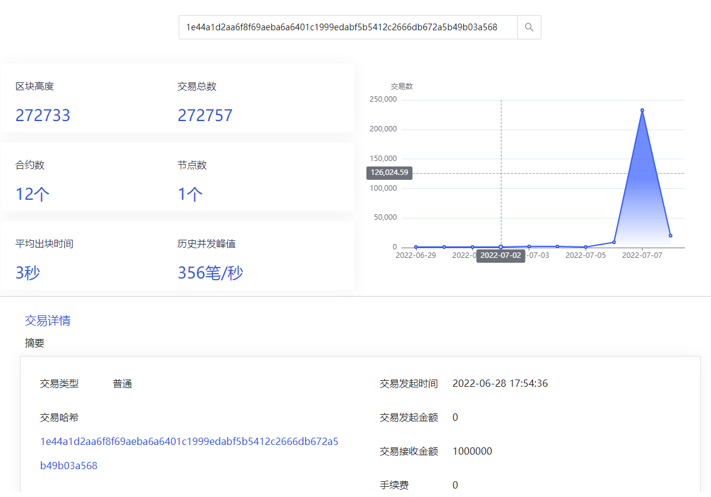

## 介绍

>chaineye是一款开源的联盟链监控平台，目前已经支持百度XuperChain，提供企业级的功能特性，开箱即用的产品体验。

- 内置丰富的Dashboard、好用实用的告警管理、自定义视图、故障自愈；
- Dashboard和告警策略支持一键导入，详细的指标分类和解释；
- 支持多 Prometheus 数据源管理，以一个集中的视图来管理所有的告警和dashboard；
- 支持 Prometheus、M3DB、VictoriaMetrics、Influxdb、TDEngine 等多种时序库作为存储方案；
- 原生支持 PromQL；
- 支持 Exporter 作为数据采集方案；
- 支持 Telegraf 作为监控数据采集方案；
- 支持对接 Grafana 作为补充可视化方案；

## 预览


## 快速安装
- 前置:需要安装Prometheus或者其他工具作为数据源。已有正在运行的XuperChain网络。
- 克隆项目到本地 项目地址 https://github.com/shengjian-tech/chaineye
- 编译项目,进入`src`目录, `go mod tidy`下载依赖, `go build -o xxx`编译完成。
- 修改 [./etc/server.conf](./etc/server.conf) 和 [./etc/webapi.conf](./etc/webapi.conf) 配置文件。
- `server.conf` 配置中主要配置日志等级，输出路径; 服务端口;Redis连接，数据库连接;`[Reader]` 和 `[Writers]` 设置为Prometheus服务连接，或者其他数据源连接地址。
- `webapi.conf` 配置中主要配置日志等级，输出路径; 服务端口;JWTAuth;Redis 连接, 数据库连接, `[[Clusters]]` 即Prometheus等数据源连接地址，以及最后监控 `XuperChain` 的配置，包括超级链节点地址，超级链SDK配置文件路径。
- 修改完配置文件后，在根目录执行命令即可启动`server` 和 `webapi` 服务。命令 `./src/xxx server -> server.out &` 和 `./src/xxx webapi -> webapi.out &`, 随后可以通过查看日志输出，判断服务是否正常启动。

- 最后，下载`chaineye`对应前端项目`front-chaineye`。仓库路径 https://github.com/shengjian-tech/front_chaineye
- 克隆前端项目后，运行 `npm install` 和 `npm run build`。
- 配置 `ngnix`。配置入下所示。
- 访问`http://127.0.0.1:port/front_chaineye/login` 页面。账号：root 密码：root.2020  
- 导入XuperChain监控大盘，XuperChain大盘文件路径 https://github.com/xuperchain/xbench/blob/master/conf/metric/grafana-xchain.json 下载后，在监控大盘中，导入即可。

## 超级链监控大盘预览


## Nginx Server 配置
```shell
 location ~ ^/front_chaineye/ {
            root html;
            index  index.html index.htm;
            try_files $uri $uri/ /front_chaineye/index.html;
        }        

	location ~ ^/chaineye/ {
	    proxy_set_header       Host              $host;
       proxy_set_header       X-Real-IP         $remote_addr;
       proxy_set_header       X-Forwarded-For   $proxy_add_x_forwarded_for;
	    proxy_pass http://127.0.0.1:18000;
    }
```

- 配置完成。即可访问 `ngnix` server端口，访问 http://127.0.0.1:port/front_chaineye/   页面。

## 鸣谢
[夜莺nightingale](https://github.com/ccfos/nightingale)  
[XuperChain](https://github.com/xuperchain/xuperchain)